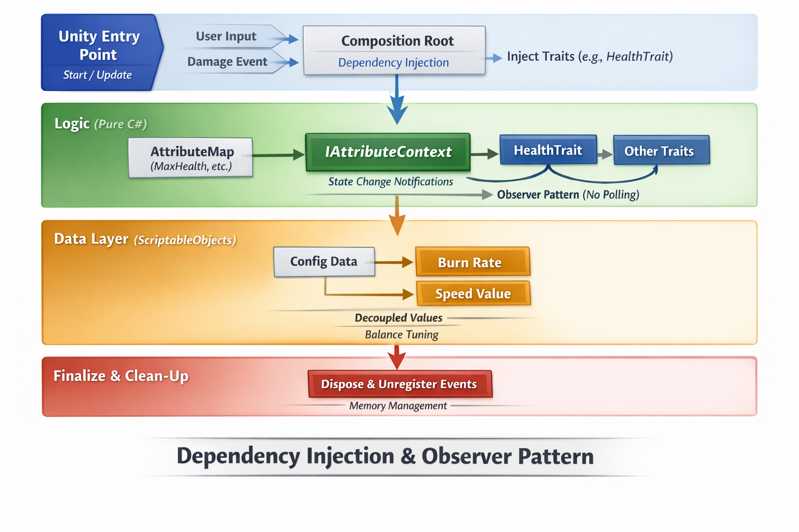

# 🧩 Unity Trait-Based Gameplay Architecture


A **highly scalable gameplay architecture for Unity** that demonstrates how to move away from rigid `MonoBehaviour` inheritance and instead build a flexible **composition-based entity system** using **Pure C# domain logic and Clean Architecture principles**.

Traditional Unity projects often evolve into tightly coupled systems where entities accumulate dozens of responsibilities. This architecture replaces that with **Trait-based composition**, allowing gameplay behaviors to remain modular, testable, and maintainable.

---

# 🚀 Overview

Traditional Unity development frequently leads to the **"God Class" problem**, where entities like `Player` or `Enemy` accumulate excessive responsibilities:

* Health
* Movement
* Combat
* Status effects
* Inventory
* AI logic

This architecture solves that problem by treating an **Entity as a container of Traits**.

Example traits:

* `HealthTrait`
* `BurnableTrait`
* `MovementTrait`
* `CombatTrait`

Traits communicate through a centralized **Attribute Blackboard**, allowing them to remain **fully decoupled**.

Instead of calling each other directly, traits **react to attribute changes through events**, creating a **reactive gameplay system**.

---

# 🧠 Design Patterns & Principles



This architecture intentionally applies several **industry-grade engineering principles** commonly used in large-scale games.

---

## Clean Architecture (Separation of Concerns)

Core gameplay logic is written in **pure C#** without any dependency on Unity.

```
Gameplay Logic  →  Pure C#
Unity Layer     →  Adapter / Composition Root
```

The `EntityController` acts as the **adapter between Unity and the domain layer**.

Benefits:

* Gameplay logic becomes **testable without Unity**
* Core systems become **engine-agnostic**
* Clear **dependency direction**

---

## Observer Pattern (Event-Driven Gameplay)

Traits do **not poll state every frame**.

Instead of this:

```
Update()
{
    if (health <= 0)
        Die();
}
```

Traits subscribe to attribute change events:

```
OnAttributeChanged(Health)
```

This eliminates unnecessary CPU work and ensures that **logic only runs when data changes**.

Benefits:

* Reduced CPU usage
* Cleaner gameplay logic
* No `Update()` spam

---

## Dependency Injection

Traits **never search for dependencies** using `GetComponent`.

Instead, required systems are **injected during initialization**.

Example dependency:

```
IAttributeContext
```

Benefits:

* Traits become **modular**
* Easy **unit testing**
* Reduced runtime coupling

---

## Data-Driven Design

Game balance data is separated from logic using **ScriptableObjects**.

Examples:

* `BurnConfig`
* `MovementConfig`
* `WeaponConfig`

Designers can tweak gameplay values **without touching code**.

Benefits:

* Faster iteration
* Safer balancing
* Cleaner separation of data and behavior

---

# 📂 Project Structure

The project uses **Assembly Definitions (`.asmdef`)** to enforce strict dependency boundaries.

```
Assets/GameplayInfrastructure/

Core/
 ├── GameplayInfrastructure.Core.asmdef
 ├── ITrait.cs
 ├── IAttributeContext.cs
 └── AttributeHashes.cs

Data/
 ├── GameplayInfrastructure.Data.asmdef
 └── ScriptableObject configurations

Traits/
 ├── GameplayInfrastructure.Traits.asmdef
 ├── HealthTrait.cs
 ├── BurnableTrait.cs
 └── Other gameplay traits

Unity/
 ├── GameplayInfrastructure.Unity.asmdef
 └── EntityController.cs
```

---

## Layer Responsibilities

| Layer      | Purpose                                             |
| ---------- | --------------------------------------------------- |
| **Core**   | Fundamental interfaces and attribute infrastructure |
| **Data**   | ScriptableObject configurations                     |
| **Traits** | Pure gameplay domain logic                          |
| **Unity**  | MonoBehaviour adapters and system assembly          |

This ensures **clean dependency flow**:

```
Unity → Traits → Core
Unity → Data → Core
```

Core systems remain **completely independent of Unity**.

---

# ⚡ Performance Considerations

This architecture is designed with **runtime performance and GC stability in mind**.

### Zero String Allocations

The attribute system uses **integer hashes** instead of strings.

Example:

```
AttributeHashes.Health
```

instead of

```
"Health"
```

Benefits:

* No string allocations
* Faster dictionary lookups
* Reduced GC pressure

---

### Pre-Allocated Data Structures

Collections are initialized with **predicted capacities** to avoid runtime resizing.

Benefits:

* Prevents memory spikes
* Improves frame stability
* Reduces hidden allocations

---

# 🛠️ How to Use

### 1. Create an Entity

Create an empty **GameObject** in your scene.

---

### 2. Add the Controller

Attach the `EntityController` MonoBehaviour.

This acts as the **composition root** for the entity.

---

### 3. Assign Configurations

Inject configuration `ScriptableObjects` via the Inspector.

Example:

* `BurnConfig`
* `MovementConfig`

---

### 4. Initialize Traits

During startup, `EntityController` constructs and initializes the traits.

Example traits:

* `HealthTrait`
* `BurnableTrait`

---

### 5. Modify Blackboard Values

External scripts can modify the entity’s **attribute blackboard**.

Example:

```
SetAttribute(AttributeHashes.IsBurning, 1);
```

Traits subscribed to that attribute will automatically react.

---

# 🎯 Example Gameplay Flow

```
External System
     ↓
Set Attribute (IsBurning = 1)
     ↓
Blackboard fires event
     ↓
BurnableTrait receives update
     ↓
Applies burn damage over time
     ↓
HealthTrait updates health
```

No direct coupling exists between traits.

---

# 🎮 Ideal Use Cases

This architecture works best for:

* RPG systems
* Status effects
* Ability systems
* AI behavior systems
* Modular gameplay mechanics

It scales extremely well as gameplay complexity grows.

---

# 📌 Requirements

* **Unity 2021+**
* C# 9+
* Assembly Definition support

---

# 📄 License

MIT License.

---

✅ If you'd like, I can also show you how to add **one diagram that makes this architecture immediately understandable to senior engineers and recruiters** (the type used in **AAA studio architecture docs**).
